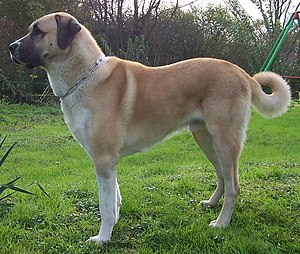

# Mein lieblings Hund
## Kangal-Hirtenhund
- Stichpunk git fetch
- Stichpunk git merge
- Stichpunk git pull

### Michael 2

Der Kangal-Hirtenhund (türkisch: Kangal Çoban Köpeği) ist eine von der Fédération Cynologique Internationale anerkannte türkische Hunderasse (FCI-Gr. 2, Sek. 2.2, Nr. 331). Die Rasse ist seit dem 6. Juni 1989 (zunächst unter der Bezeichnung Anatolischer Hirtenhund) anerkannt. Am 15. Juni 2018 wurde der erste Standard der FCI veröffentlicht, der die Rasse als Kangal-Hirtenhund bezeichnet und die Türkei als Ursprungsland festlegt.

Die Kangal-Hirtenhunde haben eine typische schwarze Zeichnung im Gesicht (Maske), aufgrund derer sie auch Karabaş (kara: türk. schwarz, baş: türk. Kopf) genannt werden.[1]

Der Name der Rasse scheint dem FCI-Standard von 2018 zufolge von der Stadt Kangal her zu kommen, denn dort gab es bereits vor der Anerkennung des Kangals als Rasse außerordentlich einheitliche Hirtenhunde, die international Aufmerksamkeit erregten.

[Link zum weiterlesen](https://de.wikipedia.org/wiki/Kangal-Hirtenhund)

